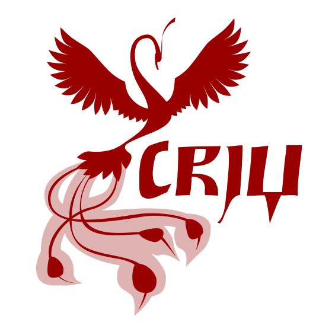
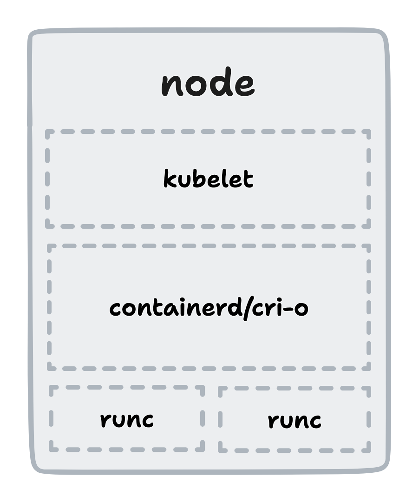

[comment]: # (THEME = white)

# Checkpoint and Restore in Kubernetes with CRIU

[comment]: # (!!!)

# Who dis? o_O

## Prajwal S N

Rust@DeepSource\
GSoC'22@CRIU\
[snprajwal.com](https://snprajwal.com)

[comment]: # (!!!)

# CRIU? Is that like CRI-O?

**CRI-O** is an OCI-compliant CRI (Oh!) implementation.

**CRIU** (Checkpoint Restore In Userspace) is a Linux tool \
that can checkpoint processes to a collection of files \
and restore from them later.

[comment]: # (!!!)

# Why C/R?

- Software breaks all the time
- Backups are hard
- Long startup times
- Need for reproducible state

[comment]: # (!!!)

# How does C/R work?

- Identify a running process with all related resources \
  and write everything to a collection of files
- Do whatever you want with the files (Move 'em? Sure. \
  Change the PID? Sure. Nuke 'em? ... Sure!)
- Restore the process from the files
- ~~Explain to your co-workers why dev is down~~

Note:
The most obvious resource you can think of is the memory occupied by the process.
- files that the process reads from or writes to
- open file descriptors
- sockets
- network connections
- and maybe some other stuff

[comment]: # (!!!)

# Gimme dem details

- CRIU defines a specific structure to store data \
  for each type of resource
- Uses protobuf as the standard format for serialising \
  data into binary files (images)
- Supports custom options to attach context

[comment]: # (!!!)

# Why is it hard?

You gotta make it work. Thrice.

[comment]: # (!!!)

[comment]: # (!!!)

# Current state of support

- runc (2015)
- LXC (2015)
- Docker (2016)
- containerd (2017)
- Podman (2018)
- Kubernetes (2022)

Note:
k8s v1.25 introduces C/R as an alpha feature

[comment]: # (!!!)

# Using C/R with k8s

- Introduced as alpha feature in v1.25
- Enable the `ContainerCheckpoint` feature flag for the cluster
- Configure the container runtime to use CRIU
    - `--enable-criu-support=true` for checkpointing
    - `--drop-infra-ctr=false` for restoring
- Call the k8s API at `/checkpoint/<namespace>/<pod>/<container>`
- Find your archive at `/var/lib/kubelet/checkpoints/<very-long-name>.tar`
- Build and push an image from the archive and restore the pod from it

[comment]: # (!!!)

# Cool stuff you can do

- Live migration of containers
- Faster startup with state initialisation
- Snapshots for debugging or analysis
- Stateful reboots
- Forensic analysis of containers
- Dry runs of updates

[comment]: # (!!!)

# Thank you!
