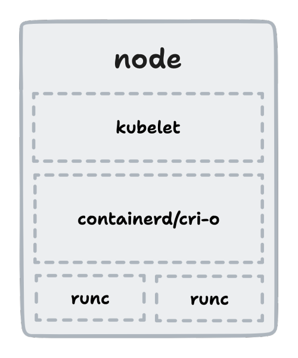

[comment]: # (THEME = white)

# Container checkpoints with Go and CRIU

[comment]: # (!!!)

# Who dis? o_O

## Prajwal S N

Go &lt;&gt; Rust \
GSoC'22,'23@CRIU \
SAOC'23@DLang \
[snprajwal.com](https://snprajwal.com)

[comment]: # (!!!)

# What is C/R?

- Identify a running process with all related resources
- Write everything to a set of files (checkpoint)
- Move files to the intended destination
- Restore the process from the files (restore)

[comment]: # (!!!)

# Why C/R?

- Software breaks all the time
- Backups are hard
- Security vulnerabilities exist
- Long startup times
- Need for reproducible state

[comment]: # (!!!)

# Reveal thy secrets, CRIU!

- Attach to the process with `ptrace`
- Collect process tree and freeze it
- Inject parasite code and collect process resources
- Serialise data into binary files (images) with protobuf
- Remove parasite code and detach from the process

[comment]: # (!!!)

# Why is it hard?

- Must have same versions of libraries on source and destination
- Parent-child relations in process trees must be kept intact
- PIDs must remain consistent across the process tree
- Cannot checkpoint isolated parent processes
- Cannot checkpoint processes that use `ptrace` themselves (GDB, strace)

[comment]: # (!!!)

[comment]: # (!!!)

# It gets harder!

You gotta make it work. Thrice.

[comment]: # (!!!)

# Behold, go-criu!

- Created to conveniently perform C/R natively in Go projects
- Provides two main libraries:
    - `phaul` for live migration of processes
    - `crit` for inspecting and manipulating checkpoints (GSoC'22)
- Used by runc, LXD, Podman, checkpointctl

[comment]: # (!!!)

# Unlocking the possibilities

- Blazingly Fast™ startup times
- Live migration of containers (`phaul`)
- Forensic analysis of containers (`checkpointctl`)
- Stateful reboots
- Dry runs of updates

[comment]: # (!!!)

# It's showtime!

[comment]: # (!!!)

# May the Force be with you!

### [snprajwal.com](https://snprajwal.com)
